<div id="en-version">

<div align="center">

# AI-Prompt-Protocols

**A curated collection of advanced prompt engineering protocols and resources.**

[中文](#zh-version)

</div>

## 📖 Table of Contents

- [About The Project](#about-the-project)
- [🚀 Key Features](#-key-features)
- [🛠️ Getting Started](#️-getting-started)
  - [Prerequisites](#prerequisites)
  - [Installation](#installation)
- [💡 Usage](#-usage)
- [📚 Definitive Guides & Protocols](#-definitive-guides--protocols)
- [🤝 Contributing](#-contributing)
- [📄 License](#-license)
- [📧 Contact](#-contact)

## About The Project

This repository is a dedicated resource for prompt engineers, developers, and AI enthusiasts. It provides a collection of structured protocols and guides for architecting sophisticated interactions with Large Language Models (LLMs). Our goal is to elevate the art and science of prompt engineering through expert-level examples, detailed guides, and reusable architectures.

## 🚀 Key Features

*   **Expert-Level Protocols:** A curated collection of advanced prompt engineering strategies.
*   **Definitive Guides:** Includes comprehensive guides on system architecture and conversational dynamics for advanced prompt engineering.
*   **Reusable Architectures:** Provides a master prompt for generating new, high-fidelity system and user prompts.
*   **Bilingual Documentation:** Fully accessible in both English and Chinese.

## 🛠️ Getting Started

Follow these simple steps to get a local copy up and running.

### Prerequisites

- A PDF reader for viewing the guides.
- A text editor for viewing the prompt files.

### Installation

1.  Clone the repository:
    ```sh
    git clone https://github.com/KuekHaoYang/AI-Prompt-Protocols
    ```
2.  Navigate to the project directory:
    ```sh
    cd AI-Prompt-Protocols
    ```

## 💡 Usage

The primary purpose of this repository is to serve as an educational and practical resource. You can:

1.  **Study the Guides:** Read the included PDF documents to deepen your understanding of advanced prompt engineering.
2.  **Utilize the Protocols:** Adapt the text-based prompt protocols for your own projects.
3.  **Generate New Prompts:** Use the `prompt_generation_prompt.txt` with a powerful LLM to architect new, specialized prompts for any task.
4.  **Explore KPrompt:** Visit the [KPrompt Website](https://github.com/KuekHaoYang/KPrompt), a web-based application designed for generating high-quality prompts.

## 📚 Definitive Guides & Protocols

These resources provide the theoretical and practical foundation for advanced prompt engineering.

*   **[Architecting Intelligence: A Definitive Guide to the Art and Science of Elite Prompt Engineering](./Architecting%20Intelligence:%20A%20Definitive%20Guide%20to%20the%20Art%20and%20Science%20of%20Elite%20Prompt%20Engineering.pdf)**
*   **[构建智能：顶级提示词工程的艺术与科学权威指南](./构建智能：顶级提示词工程的艺术与科学权威指南.pdf)**
*   **[Prompt Generation Protocol](./prompt_generation_prompt.txt)**

```mermaid
graph TD;
    subgraph book ["Architecting Intelligence: A Definitive Guide to Elite Prompt Engineering"];
        direction LR;
        
        %% Chapter 1: The Philosophy of Prompting
        ch1("Ch 1: Philosophy of Prompting");
        
        %% Chapter 2: Anatomy of an Effective Prompt
        ch2("Ch 2: Anatomy of an Effective Prompt");
        ch1 --> ch2;
        subgraph sg_ch2 ["Anatomy"];
            direction TB;
            pillar_context["Pillar 1: Context ('Who' & 'Why')"];
            pillar_task["Pillar 2: Task ('What')"];
            pillar_format["Pillar 3: Format ('How')"];
            
            ch2 --> pillar_context;
            ch2 --> pillar_task;
            ch2 --> pillar_format;

            context_role["Assign a Role/Persona"];
            context_bg["Provide Background Info"];
            context_audience["Define the Audience"];
            context_goal["State the Goal/Purpose"];
            
            pillar_context --> context_role;
            pillar_context --> context_bg;
            pillar_context --> context_audience;
            pillar_context --> context_goal;
            
            task_verb["Use Strong, Unambiguous Verbs"];
            task_chunking["Break Down Complexity (Chunking)"];
            task_specific["Be Explicit and Specific"];
            task_constraints["State Constraints and Boundaries"];
            
            pillar_task --> task_verb;
            pillar_task --> task_chunking;
            pillar_task --> task_specific;
            pillar_task --> task_constraints;
            
            format_name["Explicitly Name the Format"];
            format_fewshot["Provide Examples (Few-Shot Formatting)"];
            format_structure["Specify Structural Elements & Tone"];
            
            pillar_format --> format_name;
            pillar_format --> format_fewshot;
            pillar_format --> format_structure;
        end

        %% Chapter 3: System vs. User Prompts
        ch3("Ch 3: The Two Pillars");
        ch2 --> ch3;
        subgraph sg_ch3 ["System vs. User Prompts"];
            direction TB;
            sys_prompt["System Prompt ('The Constitution / Character Brief')"];
            usr_prompt["User Prompt ('The Conversational Directive')"];

            ch3 --> sys_prompt;
            ch3 --> usr_prompt;

            sys_prop1["Defines AI's core identity, rules, constraints"];
            sys_prop2["Persistent for the entire session"];
            sys_prop3["Set pre-conversationally"];
            sys_prompt --> sys_prop1;
            sys_prompt --> sys_prop2;
            sys_prompt --> sys_prop3;

            usr_prop1["Specific, task-oriented instruction"];
            usr_prop2["Dynamic, changes with each turn"];
            usr_prop3["Action-driven and contextual"];
            usr_prompt --> usr_prop1;
            usr_prompt --> usr_prop2;
            usr_prompt --> usr_prop3;
        end
        
        %% Foundational Strategies
        strategies_foundation("Foundational Strategies");
        ch3 --> strategies_foundation;

        %% Chapter 4: Zero-Shot Strategy
        ch4("Ch 4: The Zero-Shot Strategy");
        strategies_foundation --> ch4;
        ch4_desc["Instructing without providing examples"];
        ch4 -- "Relies on model's intrinsic knowledge" --> ch4_desc;

        %% Chapter 5: Few-Shot and One-Shot Strategy
        ch5("Ch 5: The Few-Shot & One-Shot Strategy");
        ch4 --> ch5;
        ch5_desc["Guiding AI with 1+ examples (In-Context Learning)"];
        ch5 -- "Used for specific formats, nuanced tasks, or unique styles" --> ch5_desc;
        
        %% Chapter 6: The Persona Strategy
        ch6("Ch 6: The Persona Strategy");
        strategies_foundation --> ch6;
        ch6_desc["Assigning an expert role to the AI"];
        ch6_principle1["Principle 1: First-Person Identity ('I am...')"];
        ch6_principle2["Principle 2: Elite Persona Instantiation"];
        ch6_principle3["Principle 3: Archetypal Embodiment"];
        ch6 --> ch6_desc;
        ch6_desc --> ch6_principle1;
        ch6_desc --> ch6_principle2;
        ch6_desc --> ch6_principle3;
        
        %% Content & Structure Strategies
        strategies_content("Content & Structure Strategies");
        strategies_foundation --> strategies_content;
        
        %% Chapter 7: The Specificity Strategy
        ch7("Ch 7: The Specificity Strategy");
        strategies_content --> ch7;
        ch7_desc["Eliminating ambiguity by providing details"];
        ch7_tech1["Quantify everything possible"];
        ch7_tech2["Define constraints and boundaries"];
        ch7_tech3["Decompose into sub-tasks"];
        ch7 --> ch7_desc;
        ch7_desc --> ch7_tech1;
        ch7_desc --> ch7_tech2;
        ch7_desc --> ch7_tech3;
        
        %% Chapter 8: The Contextual Priming Strategy
        ch8("Ch 8: The Contextual Priming Strategy");
        strategies_content --> ch8;
        ch8_desc["Providing rich background to ground the AI"];
        ch8_tech1["Provide source material (Grounding Data)"];
        ch8_tech2["Provide situational context (The 'Why')"];
        ch8_tech3["Leverage conversational history"];
        ch8 --> ch8_desc;
        ch8_desc --> ch8_tech1;
        ch8_desc --> ch8_tech2;
        ch8_desc --> ch8_tech3;
        
        %% Chapter 9: The Structural Strategy
        ch9("Ch 9: The Structural Strategy");
        strategies_content --> ch9;
        ch9_desc["Using delimiters and XML tags for clarity"];
        ch9_tool1["Delimiters (###, ---) for simple separation"];
        ch9_tool2["XML Tags (<tag>) for hierarchical control"];
        ch9 --> ch9_desc;
        ch9_desc --> ch9_tool1;
        ch9_desc --> ch9_tool2;
        
        %% Reasoning Strategies
        strategies_reasoning("Advanced Reasoning Strategies");
        strategies_content --> strategies_reasoning;
        
        %% Chapter 10: Chain-of-Thought (CoT)
        ch10("Ch 10: Chain-of-Thought (CoT) Strategy");
        strategies_reasoning --> ch10;
        ch10_desc["Instructing the model to 'think step-by-step'"];
        ch10_zero["Zero-Shot CoT ('Let's think step by step.')"];
        ch10_few["Few-Shot CoT (Providing examples of reasoning)"];
        ch10 --> ch10_desc;
        ch10_desc --> ch10_zero;
        ch10_desc --> ch10_few;

        %% Chapter 11: Self-Consistency
        ch11("Ch 11: The Self-Consistency Strategy");
        ch10 --> ch11;
        ch11_desc["Enhancing CoT with multiple reasoning paths and majority voting"];
        ch11_step1["1. Generate Diverse Paths (via Temperature)"];
        ch11_step2["2. Extract Final Answer from Each Path"];
        ch11_step3["3. Select Most Consistent Answer (Majority Vote)"];
        ch11 --> ch11_desc;
        ch11_desc --> ch11_step1;
        ch11_step1 --> ch11_step2;
        ch11_step2 --> ch11_step3;

        %% Chapter 12: Tree-of-Thoughts (ToT)
        ch12("Ch 12: The Tree-of-Thoughts (ToT) Strategy");
        ch11 --> ch12;
        ch12_desc["Exploring multiple solution branches simultaneously"];
        ch12_step1["1. Thought Generation (Brainstorm multiple next steps)"];
        ch12_step2["2. State Evaluation (Critique the viability of each step)"];
        ch12_step3["3. Search & Pruning (Select best path, backtrack if needed)"];
        ch12 --> ch12_desc;
        ch12_desc --> ch12_step1;
        ch12_step1 --> ch12_step2;
        ch12_step2 --> ch12_step3;
        
        %% Chapter 13: Step-Back Strategy
        ch13("Ch 13: The Step-Back Strategy");
        strategies_reasoning --> ch13;
        ch13_desc["Generalizing a problem to unlock broader knowledge"];
        ch13_stepA["Step 1: The Abstraction Prompt (Ask for general principles)"];
        ch13_stepB["Step 2: The Application Prompt (Use principles as context for specific problem)"];
        ch13 --> ch13_desc;
        ch13_desc --> ch13_stepA;
        ch13_stepA --> ch13_stepB;

        %% Chapter 14: Self-Correction Strategy
        ch14("Ch 14: The Self-Correction Strategy");
        strategies_reasoning --> ch14;
        ch14_desc["Prompting the AI to review and refine its own work"];
        ch14_loop["Prompt -> [AI Draft] -> [AI Critique] -> [Final Output]"];
        ch14 --> ch14_desc;
        ch14_desc --> ch14_loop;
        
        %% Agentic & Workflow Strategies
        strategies_agentic("Agentic & Workflow Strategies");
        strategies_reasoning --> strategies_agentic;

        %% Chapter 15: ReAct Strategy
        ch15("Ch 15: The ReAct Strategy (Reason + Act)");
        strategies_agentic --> ch15;
        ch15_desc["Combining reasoning with action via external tools"];
        ch15_loop["Thought (Plan next action) --> Action (Use a tool) --> Observation (Process tool output)"];
        ch15 --> ch15_desc;
        ch15_desc --> ch15_loop;
        ch15_loop --> ch15_loop;

        %% Chapter 16: Prompt Chaining Strategy
        ch16("Ch 16: The Prompt Chaining Strategy");
        strategies_agentic --> ch16;
        ch16_desc["Breaking down complex workflows into sequential, single-purpose prompts"];
        ch16_flow["Prompt A -> Output A -> Input for Prompt B -> Output B"];
        ch16 --> ch16_desc;
        ch16_desc --> ch16_flow;

        %% Chapter 17: Multi-Agent Strategy
        ch17("Ch 17: The Multi-Agent Strategy");
        ch16 --> ch17;
        ch17_desc["Decomposing workflows into a team of specialized AI agents"];
        ch17_team["Orchestrator --> Agent1(Persona A), Agent2(Persona B), Agent3(Persona C)"];
        ch17 --> ch17_desc;
        ch17_desc --> ch17_team;
        
        %% Conversational & Refinement Strategies
        strategies_refinement("Conversational & Refinement Strategies");
        strategies_agentic --> strategies_refinement;
        
        %% Chapter 18: Constructive Guidance
        ch18("Ch 18: The Constructive Guidance Strategy");
        strategies_refinement --> ch18;
        ch18_desc["Iterating and steering the AI within a conversation"];
        ch18_principle1["Use Positive Reinforcement"];
        ch18_principle2["Manage State Explicitly"];
        ch18_principle3["Correct Trajectory via Editing"];
        ch18 --> ch18_desc;
        ch18_desc --> ch18_principle1;
        ch18_desc --> ch18_principle2;
        ch18_desc --> ch18_principle3;
        
        %% Chapter 19: Affirmative Direction
        ch19("Ch 19: The Affirmative Direction Strategy");
        strategies_refinement --> ch19;
        ch19_desc["Stating what to do vs. what NOT to do"];
        ch19_good["GOOD: 'Write in a warm, empathetic tone.'"];
        ch19_bad["BAD: 'Do not sound like a robot.'"];
        ch19 --> ch19_desc;
        ch19_desc --> ch19_good;
        ch19_desc --> ch19_bad;
        
        %% Output & Parameter Control
        strategies_control("Output & Parameter Control");
        strategies_refinement --> strategies_control;
        
        %% Chapter 20: Output Formatting
        ch20("Ch 20: The Output Formatting Strategy");
        strategies_control --> ch20;
        ch20_desc["Forcing structured data like JSON and Tables"];
        ch20_tech1["Direct Command"];
        ch20_tech2["Provide Schema/Template"];
        ch20_tech3["Few-Shot Example (Gold Standard)"];
        ch20_tech4["Response Prefilling"];
        ch20 --> ch20_desc;
        ch20_desc --> ch20_tech1;
        ch20_desc --> ch20_tech2;
        ch20_desc --> ch20_tech3;
        ch20_desc --> ch20_tech4;

        %% Chapter 21: Response Prefilling
        ch21("Ch 21: The Response Prefilling Strategy");
        ch20 --> ch21;
        ch21_desc["Seeding the assistant's answer for control"];
        ch21_how["API Call: `{'role': 'assistant', 'content': '{'}`"];
        ch21 --> ch21_desc;
        ch21_desc --> ch21_how;

        %% Chapter 22: Parameter Tuning
        ch22("Ch 22: The Parameter Tuning Strategy");
        strategies_control --> ch22;
        ch22_desc["Engineering behavior with API parameters"];
        ch22_temp["Temperature (Creativity/Randomness)"];
        ch22_topk["Top-K (Whitelist of options)"];
        ch22_topp["Top-P (Probability budget)"];
        ch22 --> ch22_desc;
        ch22_desc --> ch22_temp;
        ch22_desc --> ch22_topk;
        ch22_desc --> ch22_topp;

        %% Specialized & Meta Strategies
        strategies_meta("Specialized & Meta Strategies");
        strategies_control --> strategies_meta;
        
        %% Chapter 23: Long Context
        ch23("Ch 23: The Long Context Strategy");
        strategies_meta --> ch23;
        ch23_desc["Optimizing for prompts with large data volumes"];
        ch23_p1["Rule 1: Place Instructions Last"];
        ch23_p2["Rule 2: Use Structural Tags to Index"];
        ch23_p3["Rule 3: Force Active Retrieval Step"];
        ch23 --> ch23_desc;
        ch23_desc --> ch23_p1;
        ch23_desc --> ch23_p2;
        ch23_desc --> ch23_p3;
        
        %% Chapter 24: Code Prompting
        ch24("Ch 24: The Code Prompting Strategy");
        strategies_meta --> ch24;
        ch24_desc["Best practices for code tasks"];
        ch24_gen["Generation (Provide full context & constraints)"];
        ch24_dbg["Debugging (Provide full error & case file)"];
        ch24_trans["Translation (Demand idiomatic adaptation)"];
        ch24 --> ch24_desc;
        ch24_desc --> ch24_gen;
        ch24_desc --> ch24_dbg;
        ch24_desc --> ch24_trans;
        
        %% Chapter 25: Automatic Prompt Engineering (APE)
        ch25("Ch 25: The Automatic Prompt Engineering (APE) Strategy");
        strategies_meta --> ch25;
        ch25_desc["Using AI to generate and optimize prompts"];
        ch25_gen["1. Prompt Generation Phase"];
        ch25_sel["2. Prompt Selection Phase"];
        ch25 --> ch25_desc;
        ch25_desc --> ch25_gen;
        ch25_gen --> ch25_sel;
        
        %% Chapter 26: Documentation Strategy
        ch26("Ch 26: The Documentation Strategy");
        strategies_meta --> ch26;
        ch26_desc["The critical discipline of tracking and versioning prompts"];
        ch26_why["Treat prompts like source code in version control (Git)"];
        ch26 --> ch26_desc;
        ch26_desc --> ch26_why;
        
        %% Chapter 27: Unified Framework
        ch27("Ch 27: Unified Framework");
        strategies_meta --> ch27;
        subgraph sg_ch27 ["Unified Framework"];
            direction TB;
            uf_pillar1["Pillar 1: Architecture"];
            uf_pillar2["Pillar 2: Conversation"];
            uf_pillar3["Pillar 3: Discipline"];
            ch27 --> uf_pillar1;
            ch27 --> uf_pillar2;
            ch27 --> uf_pillar3;

            uf_arch_decon["Deconstruct Workflow"];
            uf_arch_pattern["Choose Pattern (Chain, Multi-Agent)"];
            uf_arch_found["Define Foundation (Persona, Affirmative Dir.)"];
            uf_pillar1 --> uf_arch_decon;
            uf_pillar1 --> uf_arch_pattern;
            uf_pillar1 --> uf_arch_found;

            uf_conv_draft["First Output is a Draft"];
            uf_conv_steer["Steer with Precision (Guidance)"];
            uf_conv_reason["Synthesize Reasoning (CoT, ToT)"];
            uf_pillar2 --> uf_conv_draft;
            uf_pillar2 --> uf_conv_steer;
            uf_pillar2 --> uf_conv_reason;

            uf_disc_docs["Documentation Strategy"];
            uf_disc_iter["Iteration & Evaluation Mindset"];
            uf_pillar3 --> uf_disc_docs;
            uf_pillar3 --> uf_disc_iter;
        end
    end
```



## 🤝 Contributing

Contributions are what make the open-source community such an amazing place to learn, inspire, and create. Any contributions you make are **greatly appreciated**.

If you have a suggestion that would make this better, please fork the repo and create a pull request. You can also simply open an issue with the tag "enhancement".

## 📄 License

Distributed under the MIT License. See `LICENSE` for more information.

## 📧 Contact

Kuek Hao Yang - [kuekhaoyang@gmail.com](mailto:kuekhaoyang@gmail.com)

Project Link: [https://github.com/KuekHaoYang/AI-Prompt-Protocols](https://github.com/KuekHaoYang/AI-Prompt-Protocols)

</div>

---

<div id="zh-version">

<div align="center">

# AI提示词协议

**一个精心策划的高级提示词工程协议与资源集合。**

[English](#en-version)

</div>

## 📖 目录

- [关于项目](#关于项目)
- [🚀 主要功能](#-主要功能)
- [🛠️ 开始使用](#️-开始使用)
  - [先决条件](#先决条件)
  - [安装](#安装)
- [💡 使用方法](#-使用方法)
- [📚 权威指南与协议](#-权威指南与协议)
- [🤝 贡献](#-贡献)
- [📄 许可证](#-许可证)
- [📧 联系方式](#-联系方式)

## 关于项目

本仓库是为提示词工程师、开发者和AI爱好者准备的专属资源库。它提供了一系列结构化的协议和指南，用于构建与大型语言模型（LLM）的复杂交互。我们的目标是通过专家级的示例、详细的指南和可重用的架构，提升提示词工程的艺术与科学水平。

## 🚀 主要功能

*   **专家级协议：** 精心策划的高级提示词工程策略集合。
*   **权威指南：** 包含关于高级提示词工程的系统架构和对话动态的综合指南。
*   **可重用架构：** 提供一个主提示词，用于生成新的、高保真的系统和用户提示词。
*   **双语文档：** 完全支持英文和中文。

## 🛠️ 开始使用

请按照以下简单步骤在本地运行项目。

### 先决条件

- 用于查看指南的PDF阅读器。
- 用于查看提示词文件的文本编辑器。

### 安装

1.  克隆仓库：
    ```sh
    git clone https://github.com/KuekHaoYang/AI-Prompt-Protocols
    ```
2.  进入项目目录：
    ```sh
    cd AI-Prompt-Protocols
    ```

## 💡 使用方法

本仓库的主要目的是作为一个教育和实践资源。您可以：

1.  **学习指南：** 阅读附带的PDF文档，加深对高级提示词工程的理解。
2.  **运用协议：** 将基于文本的提示词协议应用于您自己的项目。
3.  **生成新提示词：** 使用 `prompt_generation_prompt.txt` 与强大的大型语言模型（LLM）结合，为任何任务构建新的、专门的提示词。
4.  **探索 KPrompt：** 访问 [KPrompt 网站](https://github.com/KuekHaoYang/KPrompt)，这是一个专门用于生成高质量提示词的网页应用程序。

## 📚 权威指南与协议

这些资源为高级提示词工程提供了理论和实践基础。

*   **[A Definitive Guide to Advanced Prompt Engineering: System Architecture and Conversational Dynamics](./A%20Definitive%20Guide%20to%20Advanced%20Prompt%20Engineering:%20System%20Architecture%20and%20Conversational%20Dynamics.pdf)**
*   **[高级提示词工程权威指南：系统架构与对话动态](./高级提示词工程权威指南：系统架构与对话动态.pdf)**
*   **[提示词生成协议](./prompt_generation_prompt.txt)**

```mermaid
graph TD;
    subgraph book ["《智能构建：高阶提示词工程权威指南》"];
        direction LR;
        
        %% Chapter 1: The Philosophy of Prompting
        ch1("第一章：提示词的哲学");
        
        %% Chapter 2: Anatomy of an Effective Prompt
        ch2("第二章：高效提示词解析");
        ch1 --> ch2;
        subgraph sg_ch2 ["解析"];
            direction TB;
            pillar_context["第一支柱：语境（“谁”与“为何”）"];
            pillar_task["第二支柱：任务（“何事”）"];
            pillar_format["第三支柱：格式（“如何”）"];
            
            ch2 --> pillar_context;
            ch2 --> pillar_task;
            ch2 --> pillar_format;

            context_role["赋予角色/人设"];
            context_bg["提供背景信息"];
            context_audience["明确受众"];
            context_goal["说明目标/目的"];
            
            pillar_context --> context_role;
            pillar_context --> context_bg;
            pillar_context --> context_audience;
            pillar_context --> context_goal;
            
            task_verb["使用强劲、明确的动词"];
            task_chunking["拆解复杂性（分块）"];
            task_specific["明确具体"];
            task_constraints["设定限制与边界"];
            
            pillar_task --> task_verb;
            pillar_task --> task_chunking;
            pillar_task --> task_specific;
            pillar_task --> task_constraints;
            
            format_name["明确指定格式"];
            format_fewshot["提供示例（小样本格式）"];
            format_structure["指定结构要素与语气"];
            
            pillar_format --> format_name;
            pillar_format --> format_fewshot;
            pillar_format --> format_structure;
        end

        %% Chapter 3: System vs. User Prompts
        ch3("第三章：两大核心支柱");
        ch2 --> ch3;
        subgraph sg_ch3 ["系统提示词 vs. 用户提示词"];
            direction TB;
            sys_prompt["系统提示词（“宪法”/“角色设定”）"];
            usr_prompt["用户提示词（“对话指令”）"];

            ch3 --> sys_prompt;
            ch3 --> usr_prompt;

            sys_prop1["定义AI的核心身份、规则与约束"];
            sys_prop2["贯穿整个会话"];
            sys_prop3["在对话开始前设定"];
            sys_prompt --> sys_prop1;
            sys_prompt --> sys_prop2;
            sys_prompt --> sys_prop3;

            usr_prop1["具体、面向任务的指令"];
            usr_prop2["动态性，随每次交互变化"];
            usr_prop3["驱动行动并基于语境"];
            usr_prompt --> usr_prop1;
            usr_prompt --> usr_prop2;
            usr_prompt --> usr_prop3;
        end
        
        %% Foundational Strategies
        strategies_foundation("基础策略");
        ch3 --> strategies_foundation;

        %% Chapter 4: Zero-Shot Strategy
        ch4("第四章：零样本策略");
        strategies_foundation --> ch4;
        ch4_desc["不提供示例进行指令"];
        ch4 -- "依赖模型自身内在知识" --> ch4_desc;

        %% Chapter 5: Few-Shot and One-Shot Strategy
        ch5("第五章：小样本与单样本策略");
        ch4 --> ch5;
        ch5_desc["通过1个或多个示例引导AI（上下文学习）"];
        ch5 -- "用于特定格式、细微任务或独特风格" --> ch5_desc;
        
        %% Chapter 6: The Persona Strategy
        ch6("第六章：人设策略");
        strategies_foundation --> ch6;
        ch6_desc["为AI赋予专家角色"];
        ch6_principle1["原则一：第一人称身份（“我是一个…”）"];
        ch6_principle2["原则二：精英人设具象化"];
        ch6_principle3["原则三：原型化体现"];
        ch6 --> ch6_desc;
        ch6_desc --> ch6_principle1;
        ch6_desc --> ch6_principle2;
        ch6_desc --> ch6_principle3;
        
        %% Content & Structure Strategies
        strategies_content("内容与结构策略");
        strategies_foundation --> strategies_content;
        
        %% Chapter 7: The Specificity Strategy
        ch7("第七章：明确性策略");
        strategies_content --> ch7;
        ch7_desc["通过提供细节消除歧义"];
        ch7_tech1["尽可能量化所有内容"];
        ch7_tech2["定义约束和边界"];
        ch7_tech3["拆解为子任务"];
        ch7 --> ch7_desc;
        ch7_desc --> ch7_tech1;
        ch7_desc --> ch7_tech2;
        ch7_desc --> ch7_tech3;
        
        %% Chapter 8: The Contextual Priming Strategy
        ch8("第八章：语境铺垫策略");
        strategies_content --> ch8;
        ch8_desc["提供丰富背景以奠定AI基础"];
        ch8_tech1["提供参考资料（基准数据）"];
        ch8_tech2["提供情境语境（“为何”）"];
        ch8_tech3["利用对话历史"];
        ch8 --> ch8_desc;
        ch8_desc --> ch8_tech1;
        ch8_desc --> ch8_tech2;
        ch8_desc --> ch8_tech3;
        
        %% Chapter 9: The Structural Strategy
        ch9("第九章：结构化策略");
        strategies_content --> ch9;
        ch9_desc["使用分隔符和XML标签提高清晰度"];
        ch9_tool1["分隔符（###, ---）用于简单分隔"];
        ch9_tool2["XML标签（<tag>）用于层级控制"];
        ch9 --> ch9_desc;
        ch9_desc --> ch9_tool1;
        ch9_desc --> ch9_tool2;
        
        %% Reasoning Strategies
        strategies_reasoning("推理策略");
        strategies_content --> strategies_reasoning;
        
        %% Chapter 10: Chain-of-Thought (CoT)
        ch10("第十章：思维链（CoT）策略");
        strategies_reasoning --> ch10;
        ch10_desc["指导模型“一步步思考”"];
        ch10_zero["零样本思维链（“我们一步步思考。”）"];
        ch10_few["小样本思维链（提供推理示例）"];
        ch10 --> ch10_desc;
        ch10_desc --> ch10_zero;
        ch10_desc --> ch10_few;

        %% Chapter 11: Self-Consistency
        ch11("第十一章：自我一致性策略");
        ch10 --> ch11;
        ch11_desc["通过多条推理路径和多数投票增强思维链"];
        ch11_step1["1. 生成多样路径（通过温度参数）"];
        ch11_step2["2. 从每条路径中提取最终答案"];
        ch11_step3["3. 选择最一致的答案（多数投票）"];
        ch11 --> ch11_desc;
        ch11_desc --> ch11_step1;
        ch11_step1 --> ch11_step2;
        ch11_step2 --> ch11_step3;

        %% Chapter 12: Tree-of-Thoughts (ToT)
        ch12("第十二章：思维树（ToT）策略");
        ch11 --> ch12;
        ch12_desc["同时探索多个解决方案分支"];
        ch12_step1["1. 思维生成（集思广益多个下一步）"];
        ch12_step2["2. 状态评估（批判性评估每一步的可行性）"];
        ch12_step3["3. 搜索与剪枝（选择最佳路径，必要时回溯）"];
        ch12 --> ch12_desc;
        ch12_desc --> ch12_step1;
        ch12_step1 --> ch12_step2;
        ch12_step2 --> ch12_step3;
        
        %% Chapter 13: Step-Back Strategy
        ch13("第十三章：回溯策略");
        strategies_reasoning --> ch13;
        ch13_desc["泛化问题以解锁更广泛的知识"];
        ch13_stepA["步骤一：抽象提示（要求给出一般原则）"];
        ch13_stepB["步骤二：应用提示（将原则作为具体问题的语境）"];
        ch13 --> ch13_desc;
        ch13_desc --> ch13_stepA;
        ch13_stepA --> ch13_stepB;

        %% Chapter 14: Self-Correction Strategy
        ch14("第十四章：自我纠正策略");
        strategies_reasoning --> ch14;
        ch14_desc["提示AI审查并完善自己的工作"];
        ch14_loop["提示词 -> [AI草稿] -> [AI批判] -> [最终输出]"];
        ch14 --> ch14_desc;
        ch14_desc --> ch14_loop;
        
        %% Agentic & Workflow Strategies
        strategies_agentic("智能体与工作流策略");
        strategies_reasoning --> strategies_agentic;

        %% Chapter 15: ReAct Strategy
        ch15("第十五章：ReAct策略（思考+行动）");
        strategies_agentic --> ch15;
        ch15_desc["通过外部工具结合推理与行动"];
        ch15_loop["思考（规划下一步行动）--> 行动（使用工具）--> 观察（处理工具输出）"];
        ch15 --> ch15_desc;
        ch15_desc --> ch15_loop;
        ch15_loop --> ch15_loop;

        %% Chapter 16: Prompt Chaining Strategy
        ch16("第十六章：提示词链策略");
        strategies_agentic --> ch16;
        ch16_desc["将复杂工作流拆解为按顺序、单一目的的提示词"];
        ch16_flow["提示词A -> 输出A -> 提示词B的输入 -> 输出B"];
        ch16 --> ch16_desc;
        ch16_desc --> ch16_flow;

        %% Chapter 17: Multi-Agent Strategy
        ch17("第十七章：多智能体策略");
        ch16 --> ch17;
        ch17_desc["将工作流分解为由专业AI智能体组成的团队"];
        ch17_team["协调器 --> 智能体1（人设A）、智能体2（人设B）、智能体3（人设C）"];
        ch17 --> ch17_desc;
        ch17_desc --> ch17_team;
        
        %% Conversational & Refinement Strategies
        strategies_refinement("对话与优化策略");
        strategies_agentic --> strategies_refinement;
        
        %% Chapter 18: Constructive Guidance
        ch18("第十八章：建设性引导策略");
        strategies_refinement --> ch18;
        ch18_desc["在对话中迭代和引导AI"];
        ch18_principle1["使用积极强化"];
        ch18_principle2["明确管理状态"];
        ch18_principle3["通过编辑修正轨迹"];
        ch18 --> ch18_desc;
        ch18_desc --> ch18_principle1;
        ch18_desc --> ch18_principle2;
        ch18_desc --> ch18_principle3;
        
        %% Chapter 19: Affirmative Direction
        ch19("第十九章：肯定性指示策略");
        strategies_refinement --> ch19;
        ch19_desc["说明做什么，而不是不做什么"];
        ch19_good["正例：“以温暖、富有同理心的语气撰写。”"];
        ch19_bad["反例：“不要听起来像个机器人。”"];
        ch19 --> ch19_desc;
        ch19_desc --> ch19_good;
        ch19_desc --> ch19_bad;
        
        %% Output & Parameter Control
        strategies_control("输出与参数控制");
        strategies_refinement --> strategies_control;
        
        %% Chapter 20: The Output Formatting Strategy
        ch20("第二十章：输出格式化策略");
        strategies_control --> ch20;
        ch20_desc["强制输出JSON和表格等结构化数据"];
        ch20_tech1["直接指令"];
        ch20_tech2["提供模式/模板"];
        ch20_tech3["小样本示例（黄金标准）"];
        ch20_tech4["预填充响应"];
        ch20 --> ch20_desc;
        ch20_desc --> ch20_tech1;
        ch20_desc --> ch20_tech2;
        ch20_desc --> ch20_tech3;
        ch20_desc --> ch20_tech4;

        %% Chapter 21: Response Prefilling
        ch21("第二十一章：响应预填充策略");
        ch20 --> ch21;
        ch21_desc["预设助手答案以进行控制"];
        ch21_how["API调用：`{'role': 'assistant', 'content': '{'}`"];
        ch21 --> ch21_desc;
        ch21_desc --> ch21_how;

        %% Chapter 22: Parameter Tuning
        ch22("第二十二章：参数调优策略");
        strategies_control --> ch22;
        ch22_desc["通过API参数调控行为"];
        ch22_temp["Temperature（创造力/随机性）"];
        ch22_topk["Top-K（选项白名单）"];
        ch22_topp["Top-P（概率预算）"];
        ch22 --> ch22_desc;
        ch22_desc --> ch22_temp;
        ch22_desc --> ch22_topk;
        ch22_desc --> ch22_topp;

        %% Specialized & Meta Strategies
        strategies_meta("专项与元策略");
        strategies_control --> strategies_meta;
        
        %% Chapter 23: Long Context
        ch23("第二十三章：长语境策略");
        strategies_meta --> ch23;
        ch23_desc["优化处理大数据量的提示词"];
        ch23_p1["原则一：指令置于最后"];
        ch23_p2["原则二：使用结构化标签进行索引"];
        ch23_p3["原则三：强制主动检索步骤"];
        ch23 --> ch23_desc;
        ch23_desc --> ch23_p1;
        ch23_desc --> ch23_p2;
        ch23_desc --> ch23_p3;
        
        %% Chapter 24: Code Prompting
        ch24("第二十四章：代码提示词策略");
        strategies_meta --> ch24;
        ch24_desc["代码任务的最佳实践"];
        ch24_gen["生成（提供完整上下文与约束）"];
        ch24_dbg["调试（提供完整错误信息与案例文件）"];
        ch24_trans["翻译（要求地道化适应）"];
        ch24 --> ch24_desc;
        ch24_desc --> ch24_gen;
        ch24_desc --> ch24_dbg;
        ch24_desc --> ch24_trans;
        
        %% Chapter 25: Automatic Prompt Engineering (APE)
        ch25("第二十五章：自动化提示词工程（APE）策略");
        strategies_meta --> ch25;
        ch25_desc["利用AI生成和优化提示词"];
        ch25_gen["1. 提示词生成阶段"];
        ch25_sel["2. 提示词选择阶段"];
        ch25 --> ch25_desc;
        ch25_desc --> ch25_gen;
        ch25_gen --> ch25_sel;
        
        %% Chapter 26: Documentation Strategy
        ch26("第二十六章：文档化策略");
        strategies_meta --> ch26;
        ch26_desc["追踪和版本化提示词的关键纪律"];
        ch26_why["将提示词视为版本控制（Git）中的源代码"];
        ch26 --> ch26_desc;
        ch26_desc --> ch26_why;
        
        %% Chapter 27: Unified Framework
        ch27("第二十七章：统一框架");
        strategies_meta --> ch27;
        subgraph sg_ch27 ["统一框架"];
            direction TB;
            uf_pillar1["第一支柱：架构"];
            uf_pillar2["第二支柱：对话"];
            uf_pillar3["第三支柱：规范"];
            ch27 --> uf_pillar1;
            ch27 --> uf_pillar2;
            ch27 --> uf_pillar3;

            uf_arch_decon["拆解工作流"];
            uf_arch_pattern["选择模式（链式、多智能体）"];
            uf_arch_found["定义基础（人设、肯定性指示）"];
            uf_pillar1 --> uf_arch_decon;
            uf_pillar1 --> uf_arch_pattern;
            uf_pillar1 --> uf_arch_found;

            uf_conv_draft["首次输出为草稿"];
            uf_conv_steer["精准引导（指导）"];
            uf_conv_reason["综合推理（思维链、思维树）"];
            uf_pillar2 --> uf_conv_draft;
            uf_pillar2 --> uf_conv_steer;
            uf_pillar2 --> uf_conv_reason;

            uf_disc_docs["文档化策略"];
            uf_disc_iter["迭代与评估思维"];
            uf_pillar3 --> uf_disc_docs;
            uf_pillar3 --> uf_disc_iter;
        end
    end
```



## 🤝 贡献

贡献使开源社区成为一个学习、启发和创造的绝佳场所。我们**非常感谢**您的任何贡献。

如果您有任何建议能让这个项目变得更好，请 fork 本仓库并创建一个 pull request。您也可以简单地提交一个带有“enhancement”标签的 issue。

## 📄 许可证

根据 MIT 许可证分发。更多信息请参见 `LICENSE` 文件。

## 📧 联系方式

Kuek Hao Yang - [kuekhaoyang@gmail.com](mailto:kuekhaoyang@gmail.com)

项目链接: [https://github.com/KuekHaoYang/AI-Prompt-Protocols](https://github.com/KuekHaoYang/AI-Prompt-Protocols)

</div>
